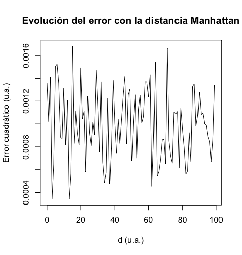

```{r setup, include=FALSE}
knitr::opts_chunk$set(echo = TRUE)
```

# Introducció

Aquesta plantilla es concep com una guia per a l’estudiant. Es pot adaptar a les necessitats de cada treball, sempre que el/la tutor/a del treball hi estigui d’acord.

## Context i justificació del treball

La rehabilitació cardíaca (RC) és una intervenció amb eficàcia demostrada per a la recuperació posterior a esdeveniments cardiovasculars. Les persones que participen en programes de RC presenten millors resultats clínics, a més d’una reducció en la taxa de readmissions hospitalàries i en la mortalitat i d’un efecte positiu en la qualitat de vida [@tessler2026]. No obstant això, la participació en aquesta mena d'intervencions és considerablement baixa i existeixen diferències de gènere en tres àrees clau: l'accés als programes, l'adherència al tractament i els resultats clínics obtinguts. Les barreres que originen aquestes desigualtats poden ser individuals, socials o pròpies dels sistemes sanitaris [@coutinho2025].

La infrarepresentació de les dones, així com d’altres col·lectius vulnerables, pot conduir a biaixos en la recerca i, en última instància, a una disminució de l’eficàcia dels tractaments. Els mètodes d'aprenentatge automàtic (ML, per les seves sigles en anglès) poden ser útils per mitigar aquestes desigualtats, però també poden perpetuar-les si no se'n tenen en compte els potencials biaixos [@caton2024]. Per això és necessari disposar d'eines per avaluar l'equitat algorítmica (*fairness*) dels models emprats i, posteriorment, millorar-la sense comprometre la precisió de les prediccions.

La tria de l'àmbit del treball està motivada per la meva formació i experiència professional prèvia com a fisioterapeuta, amb especial interès en la rehabilitació cardiorespiratòria. Si bé els biaixos en el diagnòstic i el tractament de patologies cardiovasculars són de domini públic des de fa temps, no s'ha d'oblidar l'impacte que tenen al llarg de tot el procés d'atenció sanitària, en què intervenen altres disciplines a banda de la medicina. És important dur a terme recerca de qualitat en infermeria, fisioteràpia, psicologia o nutrició per assegurar uns resultats òptims i lliures de discriminacions.

En definitiva, aquest treball pretén estudiar l’impacte dels biaixos de sexe i gènere en la predicció de resultats clínics de la RC, avaluar-ne l'equitat algorítmica i proposar mesures per atenuar-ne els efectes.

## Objectius del treball

Llistat dels objectius del treball.

## Impacte en sostenibilitat, ètic-social i de diversitat

Aquesta secció hauria d'identificar els impactes positius i/o negatius del treball final en les tres dimensions de la competència transversal UOC “Compromís ètic i global”.

La Guia transversal sobre la Competència Ètica i Global us ajudarà a redactar aquests apartats.

## Enfocament i mètode seguit

Menció de quines són les possibles estratègies per dur a terme el treball i quina és l’estratègia triada (desenvolupar un producte nou, adaptar un producte existent…). Cal incloure una valoració de per què aquesta és l’estratègia més apropiada per aconseguir els objectius.

## Planificació del treball

Descripció dels recursos necessaris per fer el treball, les tasques a realitzar i una planificació temporal de cada tasca mitjançant un diagrama de Gantt o similar. Aquesta planificació hauria de marcar quins són les fites parcials de cadascuna de les PAC.

Identificació dels possibles riscos que poden fer que aquesta planificació no es compleixi, i descripció dels plans de mitigació o alternatius en cas que aquests riscos esdevinguin un problema.

## Breu sumari de productes obtinguts

No cal entrar en detall: la descripció detallada es farà a la resta de capítols.

## Breu descripció dels altres capítols de la memòria

Breu explicació dels continguts de cada capítol i la seva relació amb el projecte global.

# Estat de l'art

Estat de l'art del tema en qüestió. Hauria d'acabar mostrant per què el treball és important i aporta alguna cosa, i amb les hipòtesis del treball.

# Materials i mètodes

En aquests apartats, cal descriure:

- Els aspectes més rellevant del disseny i desenvolupament del treball.
- La metodologia triada per a fer aquest desenvolupament, descrivint les alternatives possibles, les decisions preses, i els criteris utilitzats per prendre aquestes decisions.
- Els productes obtinguts.

# Resultats

Detalleu en aquest apartat els resultats obtinguts utilitzant la metodologia descrita a l’apartat anterior.

Recull dels resultats del treball. Hauria d'haver-hi una correspondència amb la metodologia en el sentit que els resultats és el que s'obté després d'haver aplicat la metodologia.

Les figures han d'estar explicades i citades en el text, com la \@ref(fig:grafic), en la qual es mostra l'error en funció de la distància, en unitats arbitràries. A totes les gràfiques ha d'haver el títol dels eixos.

```{r grafic, fig.cap="Error en funció de la distància en unitats arbitràries.", out.width="7cm", fig.align="center", echo=FALSE}

```

# Discussió

Discussió dels resultats en el context del projecte. És en aquest apartat on cobren sentit i en el qual es responen les preguntes de recerca i es mostra com els resultats donen resposta als problemes plantejats.

Aquesta part pot ser que no apliqui segons el tipus de treball.

# Valoració econòmica

En cas que correspongui, s'inclourà un apartat de \`\`Valoració econòmica del treball". Aquest apartat indicarà les despeses associades al desenvolupament i manteniment del treball, així com els beneficis econòmics obtinguts. Cal fer una anàlisi final sobre la viabilitat del producte.

# Conclusions i treballs futurs

## Conclusions

Aquest capítol ha d'incloure:

- Una descripció de les conclusions del treball:

  - Un cop s’han obtingut els resultats quines conclusions s’extreu?
  - Aquests resultats són els esperats? O han estat sorprenents? Per què?

- Una reflexió crítica sobre l’assoliment dels objectius plantejats inicialment:

  - Hem assolit tots els objectius? Si la resposta és negativa, per quin motiu?

## Línies de futur

Les línies de treball futur que no s'han pogut explorar en aquest treball i han quedat pendents.

## Seguiment de la planificació

- Una anàlisi crítica del seguiment de la planificació i metodologia al llarg del producte:

  - S’ha seguit la planificació?
  - La metodología prevista ha estat prou adequada?
  - Ha calgut introduir canvis per garantir l’èxit del treball? Per què?

- Dels impactes previstos a [1], ètic-socials, de sostenibilitat i de diversitat, avaluaeu/esmenteu si s'han mitigat (si eren negatius) o si s'han aconseguit (si eren positius).

- Si han aparegut impactes no previstos a [1], avaluar/esmentar com s'han mitigat (si eren negatius) o què han aportat (si eren positius).

# Glossari

Definició dels termes i acrònims més rellevants utilitzats dins la Memòria.

# Bibliografia

<div id="refs"></div>

\newpage
\appendix

# Exemple d'annex

## Annex 1

# Exemple d'annex

## Annex B
